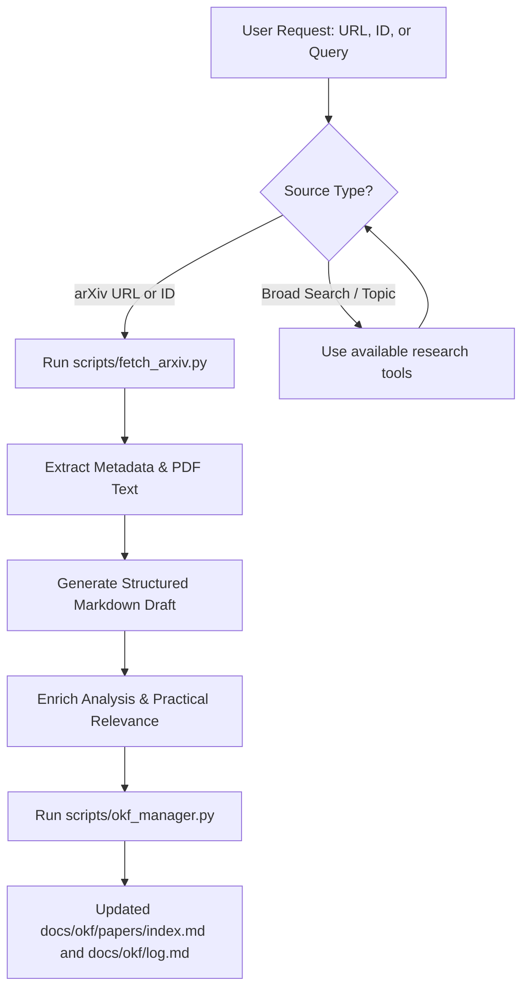

# Paper Reader & Ingestion Skill

Document papers under `docs/okf/papers/` using the Open Knowledge Format (OKF). Ground technical claims in the full source.

## Workflow Overview

When the user asks to "pull", "read", "summarize", or "add" a research paper:



---

## Step 1: Search and Ingestion Capabilities

### Option A: Using paper research tools (when available)
If `paper-search-mcp` is configured, it may expose tools for querying and reading academic literature across arXiv, Semantic Scholar, PubMed, bioRxiv, and CrossRef:
- **`read_arxiv_paper(paper_id)`**: Directly downloads and reads the paper text into context without writing large binary files.
- **`download_arxiv(paper_id, save_path)`**: Downloads the paper PDF to the specified local path.
- **`search_arxiv(query)`** / **`search_papers(query)`**: Searches academic repositories for literature on a topic (e.g. "3D Gaussian Splatting real time").
- **Other providers**: `read_semantic_paper`, `read_biorxiv_paper`, `read_pubmed_paper`, etc.

### Option B: Using `scripts/fetch_arxiv.py` (Local CLI Script)
For arXiv ingestion from the repository root:
```bash
uv run --no-project --python 3.12 scripts/fetch_arxiv.py <arxiv_id_or_url> --write
```
This utility:
1. Queries arXiv's Atom API for structured metadata (title, authors, publication date, abstract, categories).
2. Downloads the PDF into a temporary directory. Requires network access and Poppler's `pdftotext` on `PATH` or under `.tools/poppler/`.
3. Uses `pdftotext` to extract the full text for source review.
4. Generates an OKF Markdown draft under `docs/okf/papers/<slug>.md` without overwriting existing work. Without `--write`, the draft is printed to stdout.

In a restricted Windows sandbox, set `UV_CACHE_DIR` to a writable temporary directory before running `uv`.

---

## Step 2: Enrich the Paper Breakdown
Open the generated `docs/okf/papers/<slug>.md` and replace its generic analysis notes with a source-backed breakdown:

1. **Executive Summary**: Clear problem statement and overarching methodology.
2. **Key Innovations & Contributions**: Describe the paper's actual method or DSP technique.
3. **Architecture & Methodology**:
   - Signal representation and processing stages, when applicable.
   - Relevant equations, filters, or nonlinear operations.
   - Evaluation setup and assumptions.
4. **Experimental Results & Benchmarks**:
   - Metrics reported by the paper, such as alias energy, latency, CPU cost, or listening results.
   - Baseline comparisons.
   - Known limitations or failure modes.
5. **Practical Relevance to DisDorktion**: Connect to distortion, DSP, or plug-in design only where the source supports it.
6. **BibTeX Citation**: Verify the generated citation against the source before using it elsewhere.

---

## Step 3: Index and Log
Once the paper document is written:
```bash
uv run --no-project --python 3.12 scripts/okf_manager.py --update-indices --log "Ingested paper: <Paper Title> (docs/okf/papers/<slug>.md)" --validate
```

Confirm that `docs/okf/papers/index.md` and `docs/okf/log.md` reflect the new paper.
